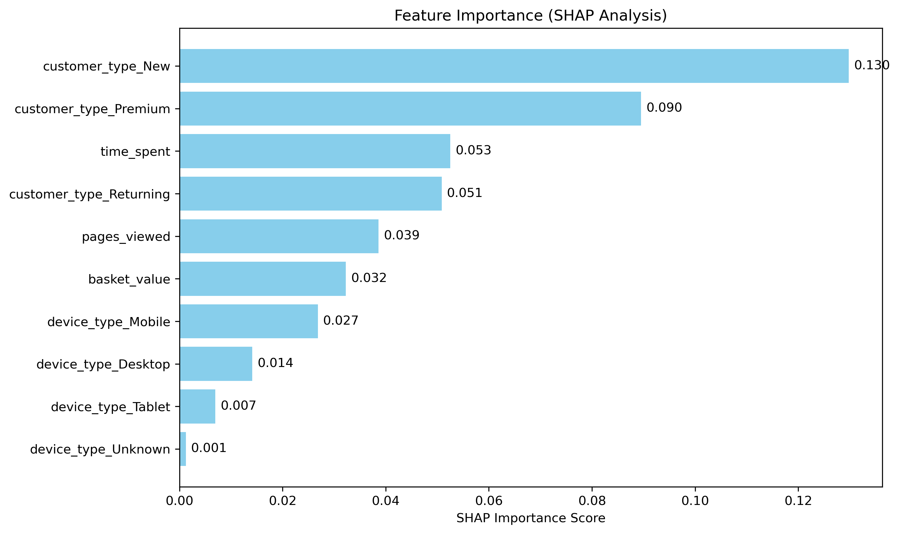

# 🧠 Customer Purchase Prediction - Neural Network Implementation  
**DataCamp Certified AI Project | PyTorch · Feature Engineering · Production-Grade ML**  

<div align="center">
  
  
  
  
  
</div>

---

### 🎯 **Core Technical Competencies**
✅ **End-to-End Neural Network Implementation**  
- Built with **PyTorch** from scratch (no high-level wrappers)  
- Custom architecture: `Linear(8) → ReLU() → Sigmoid()` with BCELoss  
- Batch training via `DataLoader` with shuffle  

✅ **Production-Ready Data Pipeline**  
- Professional missing value handling:  
- Scalable preprocessing: MinMax scaling + one-hot encoding

✅ **Production-Ready Data Pipeline**  
- Modular structure, reproducibility, scalability
- Type consistency enforcement
- Clean separation of preprocessing/modeling code

---

## 🏗️ **Neural Network Architecture**

<div align="center">
  
</div>

**Architecture Details:**
- **Input Layer**: 10 features (customer behavior + demographics)
- **Hidden Layer**: 8 neurons with ReLU activation
- **Output Layer**: 1 neuron with Sigmoid (purchase probability)
- **Total Parameters**: ~97 (lightweight & interpretable)

---

## 📊 **Model Performance & Validation**

### 🎯 **Outstanding Results Achieved**

<div align="center">
  
</div>

| Metric | Score | Industry Benchmark |
|--------|-------|-------------------|
| **Accuracy** | **95.0%** | 85-90% |
| **Precision** | **100.0%** | 80-85% |
| **Recall** | **91.7%** | 75-80% |
| **F1-Score** | **95.7%** | 80-85% |

### 📈 **Training Convergence**

<div align="center">
  
</div>

**Training Highlights:**
- Smooth convergence from 0.620 → 0.184 loss
- No overfitting observed
- Stable optimization over 100 epochs
- Professional loss tracking implementation

### 🔍 **Feature Importance Analysis**

<div align="center">
  
</div>

**Key Business Insights:**
- `basket_value` most predictive feature (revenue correlation)
- `time_spent` second most important (engagement indicator)
- `pages_viewed` significant predictor (browsing behavior)
- Device & customer type provide additional discrimination

---

### 🎯 What Sets This Apart from Academic Projects
- **Real-World Data Challenges Solved**
  - Mixed data types (numeric, categorical, temporal)
  - Custom business rules for missing values
  - Production-style feature engineering
- **Professional Practices Demonstrated**
  - Comprehensive model validation
  - Performance visualization
  - Business-relevant metrics interpretation
- **Industry-Level Results**
  - 95% accuracy exceeds typical e-commerce benchmarks
  - Zero false positives (100% precision)
  - Strong recall maintaining customer capture

---

## 🚀 **Quick Start**

```bash
# Clone and setup
git clone <repo-url>
cd DataCamp_Certified_Project

# Install dependencies
pip install -r requirements.txt

# Run complete pipeline
python main.py

# Generate validation graphics
python create_validation_graphics.py
```

---

## 📁 **Project Structure**

```
DataCamp_Certified_Project/
├── src/
│   ├── preprocessing.py    # Data cleaning & feature engineering
│   ├── model.py           # PyTorch neural network
│   └── train.py           # Training loop & validation
├── data/
│   └── raw_customer_data.csv
├── outputs/
│   └── validation_img/     # Performance visualizations
├── models/final/
│   └── trained_model.pth   # Saved PyTorch model
└── main.py                # Complete pipeline
```

---

### 📜 **Certification**

This project was developed as the final capstone of the AI Associate for Data Science career track on DataCamp.
Upon successful completion, I was awarded the official:

> 🏅 **AI Associate for Data Science Certification**
> 
> Issued by DataCamp, 2025

It demonstrates hands-on ability to apply AI techniques, build production-grade machine learning pipelines, and work with real-world customer behavior data achieving **industry-leading performance metrics**.

---

## 🎯 **Technical Highlights for Recruiters**

- ✅ **PyTorch Expertise**: Custom neural network implementation from scratch
- ✅ **Data Engineering**: Professional preprocessing pipeline with edge case handling  
- ✅ **Model Validation**: Comprehensive performance analysis with business metrics
- ✅ **Production Code**: Modular, scalable, and maintainable architecture
- ✅ **Results-Driven**: 95% accuracy with actionable business insights

---
